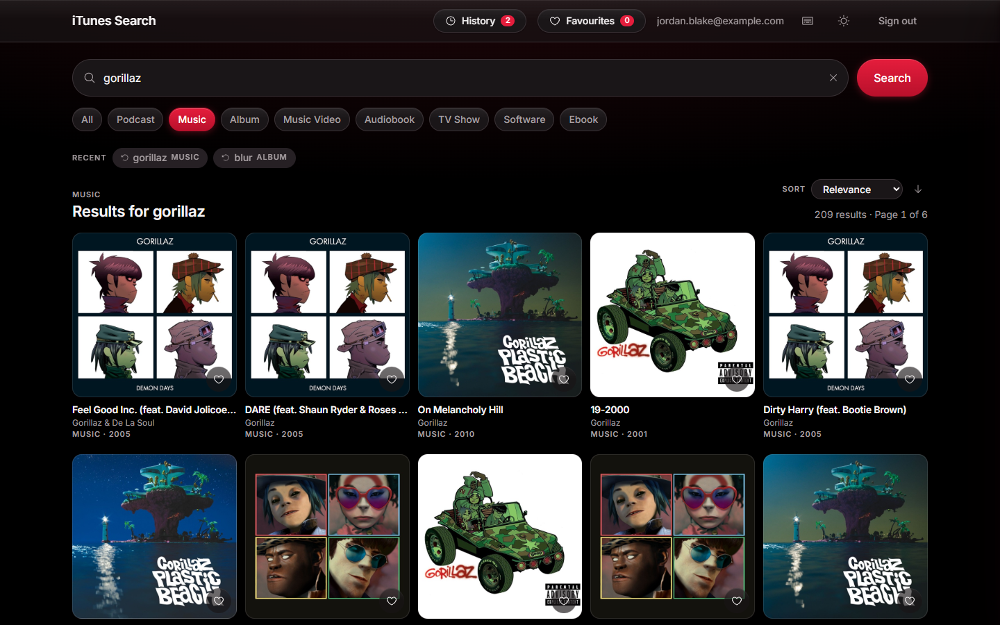
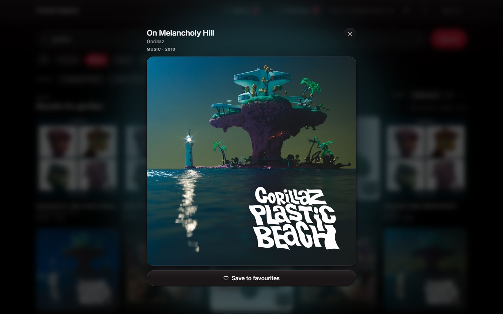
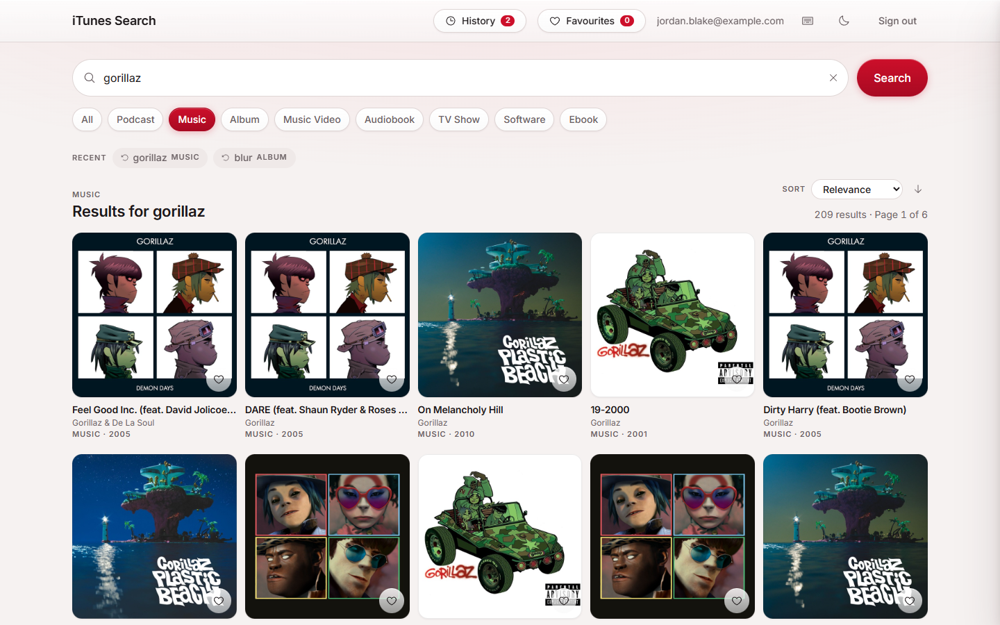
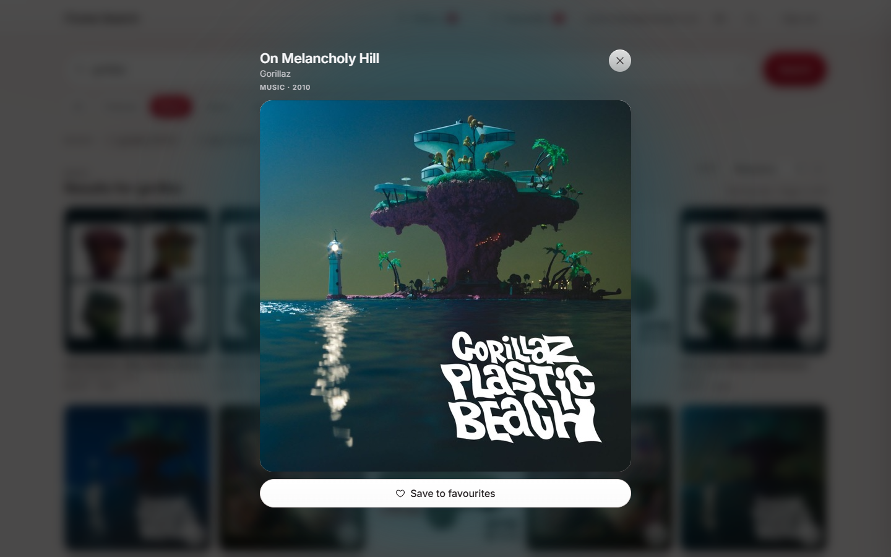

# iTunes Search

A full-stack media search app built on Apple's iTunes Search API, with JWT
authentication, saved favourites and search history, an artwork viewer tinted
from the cover it is showing, and light and dark themes.

**[Live demo](https://itunes-search-szstanton.vercel.app/)**

The login page has a one click demo sign in, so you can look around without
creating an account. The API is on a free tier that sleeps when idle, so the
first load can take up to a minute while it wakes.

If you do create an account, it and its saved items are deleted after 60 days of
inactivity. Nothing personal is kept indefinitely.

## Screenshots

<table>
  <tr>
    <td align="center">
      <strong>Results, dark</strong><br/>
      
    </td>
    <td align="center">
      <strong>Artwork viewer, dark</strong><br/>
      
    </td>
  </tr>
  <tr>
    <td align="center">
      <strong>Results, light</strong><br/>
      
    </td>
    <td align="center">
      <strong>Artwork viewer, light</strong><br/>
      
    </td>
  </tr>
</table>

## Features

- Search eight media types, from music and albums to podcasts, apps and ebooks
- Full size artwork viewer, tinted by the dominant colour of the cover
- Favourites and search history saved to the account, not the browser
- Sorting by release date, title or artist across the whole result set
- Paging by button, arrow key or the edges of the screen, with keyboard shortcuts
- Light and dark themes, remembered between visits
- Rate limited authentication and protected API routes

## Tech Stack

| Area       | Technologies                              |
| ---------- | ----------------------------------------- |
| Frontend   | React, Vite, React Router, Context API    |
| Backend    | Node.js, Express, Mongoose                |
| Database   | MongoDB Atlas                             |
| Styling    | Tailwind, CSS custom properties, Phosphor |
| Validation | Zod                                       |
| Testing    | Vitest, Testing Library                   |
| Deployment | Vercel, Render                            |

## Getting Started

Requires Node 24 and a MongoDB Atlas cluster.

```bash
git clone https://github.com/SZStanton/iTunes-Search
cd iTunes-Search
npm install
```

Create the environment file and fill it in:

```bash
cp server/.env.example server/.env
```

| Variable                  | Where         | Notes                            |
| ------------------------- | ------------- | -------------------------------- |
| `MONGODB_URI`             | `server/.env` | include the database name        |
| `JWT_SECRET`              | `server/.env` | any long random string           |
| `CLIENT_URL`              | `server/.env` | the only origin allowed to call  |
| `PORT`                    | `server/.env` | 5000, to match the dev proxy     |
| `DEMO_EMAIL`, `_PASSWORD` | `server/.env` | optional, enables the demo login |
| `VITE_API_URL`            | deployment    | the API's URL, no trailing slash |

Locally the client leaves `VITE_API_URL` unset and the Vite proxy forwards to
the API, so `client/.env` is only needed when deploying.

Then run both halves together:

```bash
npm run dev                   # api and frontend
npm run seed:demo -w server   # optional, sets up the demo account
npm test                      # test suite
npm run build                 # production build of the frontend
```

## Testing

Vitest and Testing Library, covering the validation schemas, a cross check that
the client and server validation produce identical messages, the sorting and
colour sampling, and the signed in page. Runs from a clean clone with no
database.

```bash
npm test
```

## What I Learned

- Working with a third party REST API, and shaping the app around what it
  actually returns rather than what the documentation promises
- Wrapping someone else's API in my own Express layer, so validation, filtering
  and rate limiting live in one place
- Designing an interface around images I do not control, including artwork that
  fails to load, comes back portrait, or arrives with fields missing
- Paging and sorting a full result set in the browser, because the API ignores
  `offset` and server side paging is not possible
- Deploying a full stack application across Vercel, Render and Atlas
