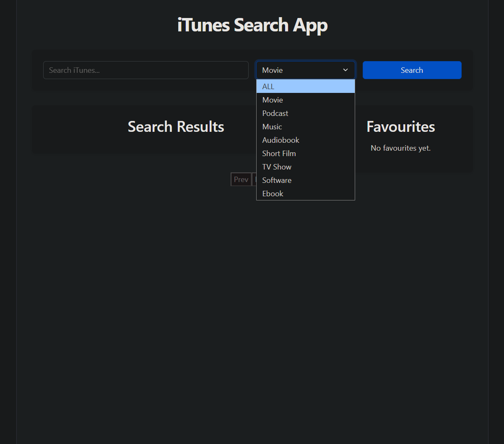
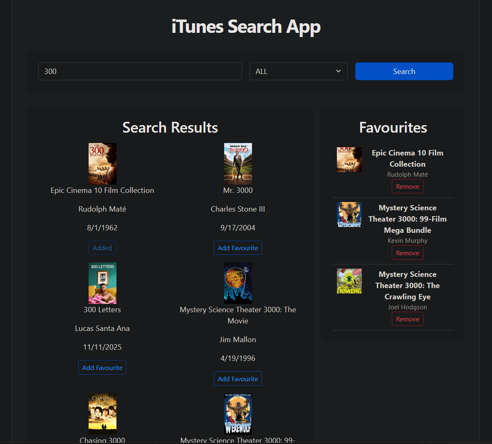

# iTunes Search App

A full-stack app for searching the iTunes catalogue, filtering by media type, and saving favourites. This project demonstrates consuming a third-party REST API, combined with a JWT-secured Node/Express backend for managing user favourites.

## Screenshots

<table>
  <tr>
    <td></td>
    <td></td>
  </tr>
</table>

## Features

- Search the iTunes API by keyword
- Filter results by media type (Movie, Music, Podcast, Audiobook, Short Film, TV Show, Software, Ebook)
- Add/remove items from a favourites list
- Paginated search results

## Tech Stack

**Frontend:** React, Vite, Bootstrap
**Backend:** Node.js, Express, JWT

## Installation

1. Clone the repository

   ```bash
   git clone https://github.com/SZStanton/iTunes-Search
   ```

2. Navigate into the project folder and install dependencies for both frontend and backend

   ```bash
   npm install
   ```

3. Set up your environment variables (`.env`) with your JWT secret

4. Run the backend

   ```bash
   npm run start
   ```

5. Run the frontend

   ```bash
   npm run dev
   ```

6. Open the app in your browser

   ```bash
   http://localhost:5173/
   ```

## Future Improvements

- Persist favourites across sessions (currently session-only)
- Sort results by release date or name
